# Rss App User Guide

Rss App lets users create custom RSS feeds assigned to their user accounts. Users can add RSS links in the xml format and organize them into groups for their convenience. 

1. To use Rss App you need to register an account or log in.
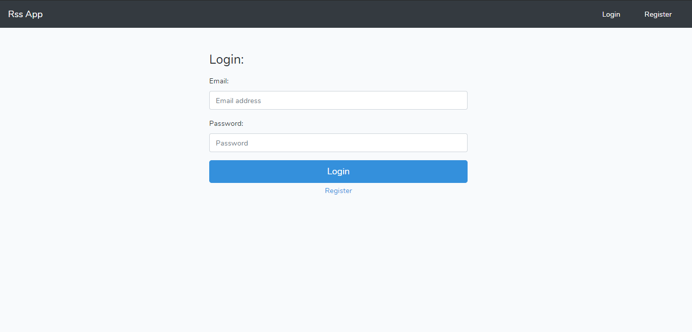

2. If you already have an account, you will be taken to the homepage after loging in.
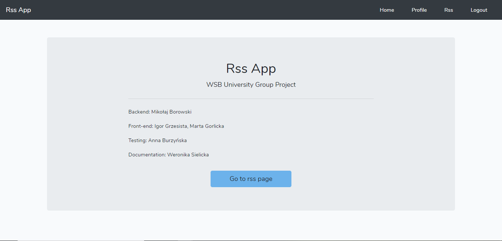

3. To register an account, you need to provide a username, email address which will recieve configured RSS feeds, and password, which needs to be at least 6 characters long.
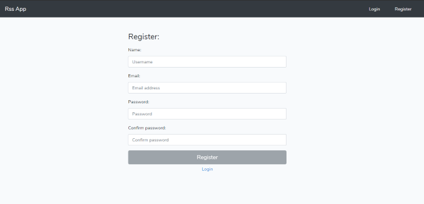

4. Once you succesfully register an account, you are taken to the **Profile** tab, in which:

- you can see you account details. 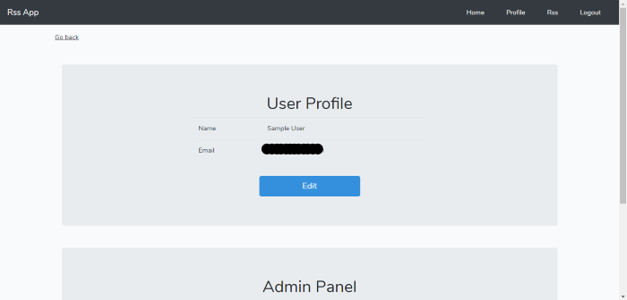
- you can edit your account details, meaning provide a different username or email address. 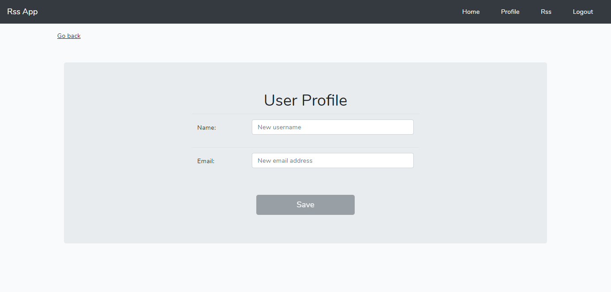
- if you are and administrator, you can manage users and grant them admin permission. 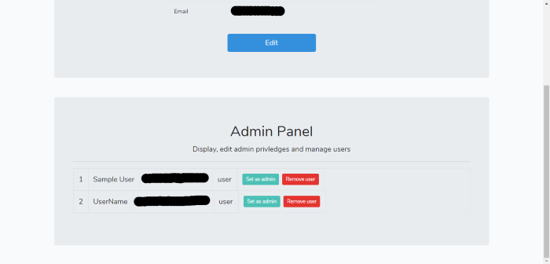

5. To configure your RSS feed, go to the **Rss** tab. 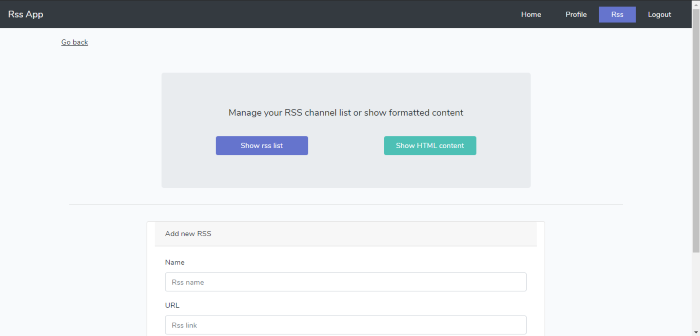 In the *Rss* tab, you can:

- add an RSS link in an xml format to your feed and give it a custom nam.e 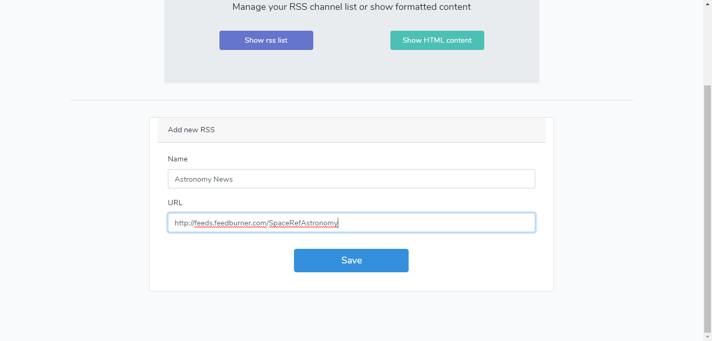
- view the list of links in your RSS feed by clicking **Show rss list**. 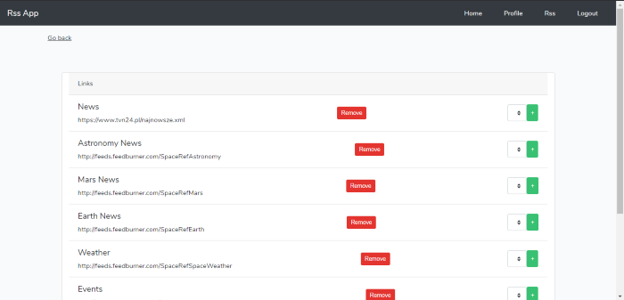
- after clicking **Show rss list**, you can remove RSS links from your feed by clicking **Remove** by the link you wish to be gone.
- after clicking **Show rss list**, you can add groups for RSS links by typing a name of a group and clicking the green plus icon. 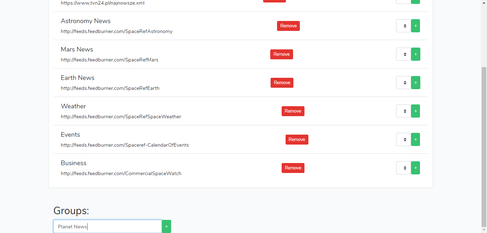
- after clicking **Show rss list**, you can view manage groups of links by renaming or removing them. 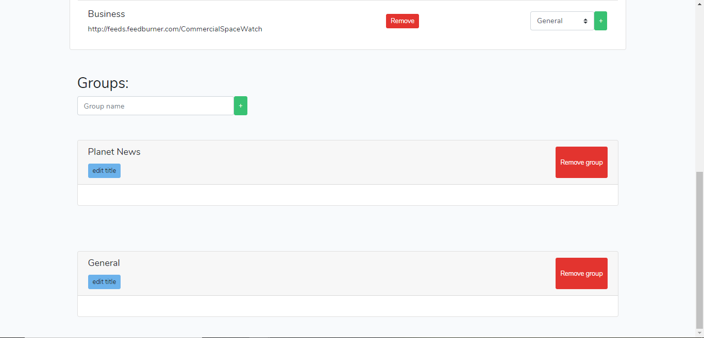
- after clicking **Show rss list**, you can each RSS link to a group using the drop-down picker. 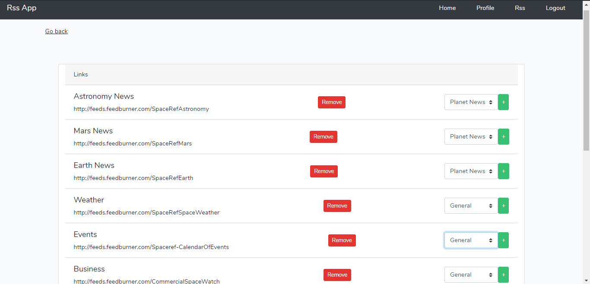
- after clicking **Show HTML content**, you can view a preview of your custom RSS feed. 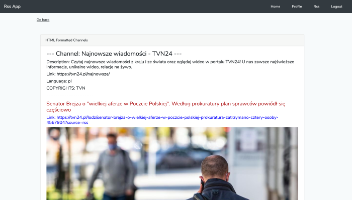

6. After you're done configuring or editing your custom RSS feed, log out by clicking **Logout** in the top right corner.
